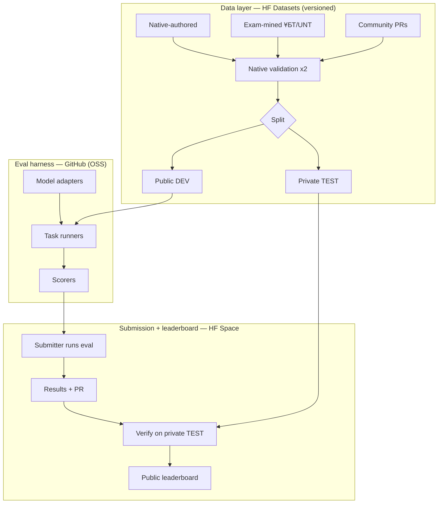

# KazBench — Vision & Architecture

*Status: design phase (no code yet). Clean slate after spike removed June 2026.*

---

## 1. Goal (the why)

**KazBench becomes the standard, trusted measurement of how well any AI model handles the
Kazakh language.** Today nobody can answer "which LLM is best at Kazakh?" with numbers —
KazBench makes that measurable.

It serves four converging objectives at once:

| Objective | How KazBench serves it |
|---|---|
| **Benefit to Kazakhstan** | Makes Kazakh a first-class, measurable language for AI; pressures/guides model builders to support it; helps preserve & digitize the language |
| **Career (job in US)** | Portfolio centerpiece for an NLP/LLM Engineer; recruiter magnet; GitHub social proof |
| **Grad school** | Publishable research artifact (low-resource NLP → ACL/EMNLP workshop); reproducibility package |
| **Virality / infrastructure** | "Everyone evaluating Kazakh LLMs uses it" → citations + stars |

The defining property: **it is infrastructure, not a one-off model or demo** — a measuring
stick others build on.

## 2. Final product (the what)

A **living, trusted public benchmark + leaderboard** for Kazakh-language AI:

1. **Evaluation suite** — a curated, native-validated set of Kazakh tasks (knowledge, reading,
   sentiment, translation, morphology, instruction-following...), split into a **public DEV** set
   and a **private TEST** set, published & versioned on Hugging Face Datasets.
2. **Open-source eval harness** — model-agnostic; anyone runs it on any model (Claude,
   OpenAI-compatible, local/HF) via a simple `generate(prompt)` interface. Lives on GitHub.
3. **Public leaderboard** — ranks models on Kazakh; a Hugging Face Space (Gradio). Updated by
   **decentralized submissions** (submitters run eval on their own budget → submit results + PR →
   verified on the private TEST set).
4. **Contribution pipeline + governance** — schema, PR templates, 2-native-reviewer validation,
   versioning, anti-contamination rules — so the community grows and validates the data over time.
5. **Paper + reproducibility package** — the academic output.

## 3. Architecture decisions (confirmed)

- **Eval model: decentralized submission.** Submitters run eval themselves and submit results;
  we verify on the private TEST set. Zero API cost to the project; scales.
- **Data integrity: public DEV + private TEST.** Prevents the benchmark leaking into model
  training data and keeps scores honest.
- **Hosting stack: GitHub + HF Datasets + HF Space.** Code on GitHub, data on Hugging Face,
  leaderboard as an HF Space — maximum ML-community visibility, free.

## 4. What makes or breaks it (priorities)

1. **Data quality & coverage** — the hard part. Native-authored/validated, contamination-controlled.
2. **Trust** — private test + transparent methodology + honest reporting.
3. **Contribution loop** — the social infrastructure that keeps it alive.
4. The eval code is the *easy* part — built last, kept simple.

## 5. Open scoping questions (for next session)

- Which tasks ship in v1 (which 4–6)?
- Data sourcing priority: how much native-authored vs exam-mined vs translated?
- Target size per task for a credible v1 (e.g. 100–200 items/task)?
- Naming / branding (KazBench vs alternative).
